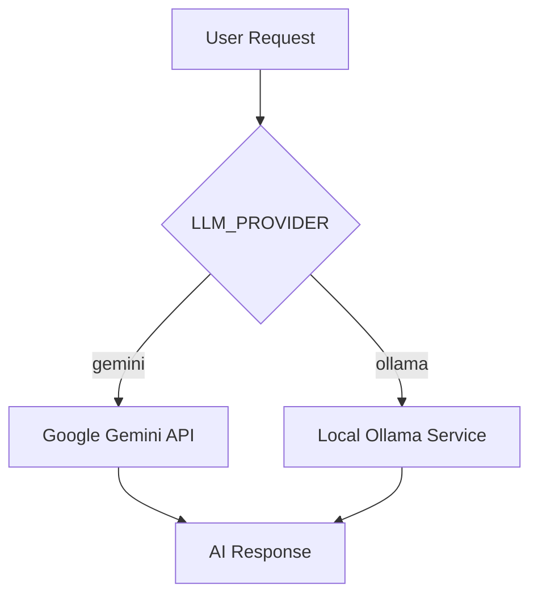

# LLM Integration Tutorial

This tutorial explains how to integrate Google Gemini and local Ollama models into the **Personal AI Core** using LangGraph.

## 1. Provider Architecture

The project uses a provider-agnostic approach. We use `langchain-google-genai` for cloud Gemini and `langchain-ollama` (or generic `ChatOpenAI` with Ollama base URL) for local inference.

### Provider Flow


### Switching Logic
The system determines the provider based on the `LLM_PROVIDER` environment variable:

```python
import os
from langchain_google_genai import ChatGoogleGenerativeAI
from langchain_ollama import ChatOllama

def get_llm():
    provider = os.getenv("LLM_PROVIDER", "gemini")
    
    if provider == "gemini":
        return ChatGoogleGenerativeAI(model="gemini-1.5-pro")
    elif provider == "ollama":
        return ChatOllama(model="llama3")
    else:
        raise ValueError(f"Unsupported provider: {provider}")
```

## 2. Using LLMs in LangGraph Nodes

In a LangGraph workflow, you typically pass the LLM instance to a node function or a tool-calling supervisor.

### Example Node: Simple Responder
```python
from app.core.graph import State

def assistant_node(state: State):
    llm = get_llm()
    response = llm.invoke(state["messages"])
    return {"messages": [response]}
```

## 3. Advanced Gemini Features

Gemini 1.5 Pro supports multimodal inputs (images, audio, video). You can pass these as parts of the message content:

```python
from langchain_core.messages import HumanMessage

def analyze_floorplan(image_path: str):
    llm = ChatGoogleGenerativeAI(model="gemini-1.5-pro")
    message = HumanMessage(
        content=[
            {"type": "text", "text": "Analyze this floor plan for IoT sensor placement."},
            {"type": "image_url", "image_url": image_path},
        ]
    )
    return llm.invoke([message])
```

## 4. Local Execution with Ollama

When running locally, ensure the Ollama service is active. The system will fallback to local models if cloud connectivity is disabled or explicitly requested.

```env
LLM_PROVIDER=ollama
```
